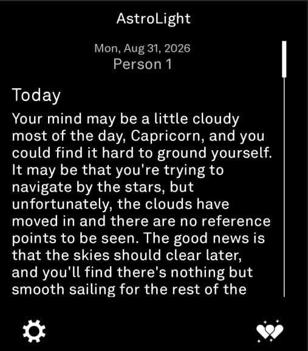
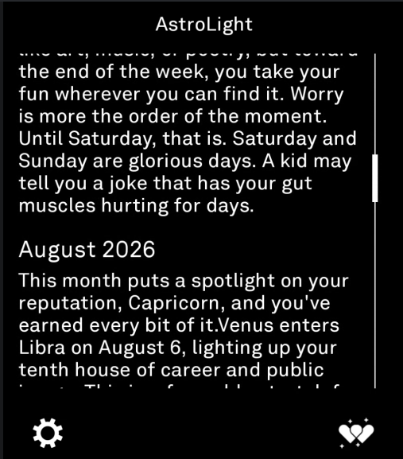
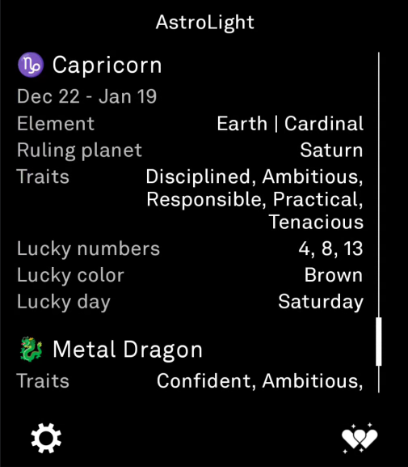
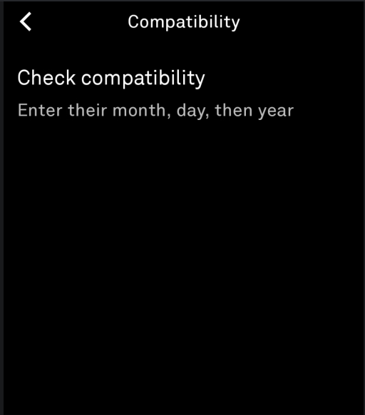
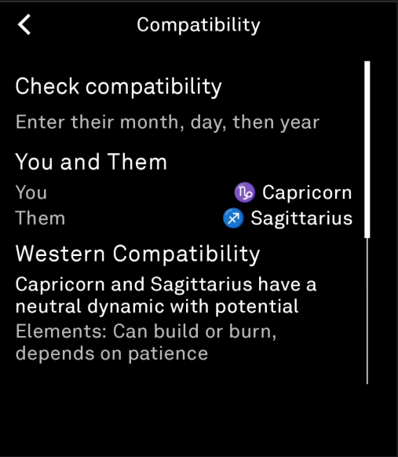
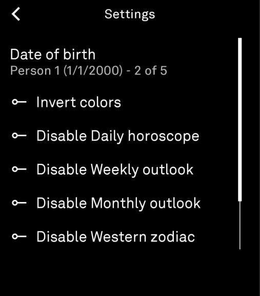
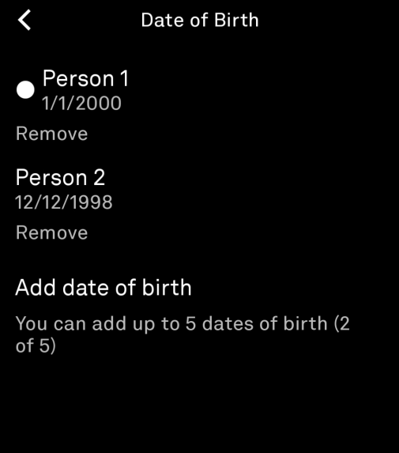

# AstroLight

A minimalist astrology companion for the Light Phone III. Daily, weekly, and monthly horoscopes alongside your Western zodiac and Chinese zodiac profiles, plus a compatibility checker.

Built with the Light SDK for LightOS. Horoscopes are fetched online when connected; zodiac profiles and compatibility work fully offline.

## Features

**Daily Horoscope** -- Today's reading for your sun sign, pulled fresh from horoscope.com.

**Weekly Outlook** -- The week ahead at a glance.

**Monthly Outlook** -- Broader themes and energy for the current month.

**Today's Luck** -- Daily-changing lucky number, lucky color, and supporting sign based on your zodiac profile.

**Western Zodiac Profile** -- Your sun sign with element, modality, ruling planet, personality traits, strengths, lucky numbers, colors, and day.

**Chinese Zodiac Profile** -- Your animal sign and elemental modifier (Wood, Fire, Earth, Metal, Water) with traits, strengths, lucky numbers, and colors. Determined by birth year using the traditional 60-year Sexagenary cycle.

**Multiple Profiles** -- Save up to 5 dates of birth for yourself and loved ones. When more than one is saved, the label under the date on the home screen becomes a toggle. Tap it to cycle through profiles and the whole screen updates with that person's sign and readings.

**Compatibility Checker** -- Enter another person's birthday to compare your Western and Chinese zodiac compatibility side by side. Element harmony, trine groups, clash pairs, and an overall read.

**Settings** -- Toggle each section on or off. Invert colors (dark mode is the default, matching LightOS). Manage your saved dates of birth and pick which one is active.

## Screenshots

<p align="center">
  
  
  
</p>
<p align="center">
  
  
  
  
</p>

## Build

Requires the Light SDK GitHub Packages token. Add your credentials to `local.properties` in the project root:

```
gpr.user=YOUR_GITHUB_USERNAME
gpr.key=YOUR_GITHUB_TOKEN
```

Build and install:

```
./gradlew :tool:assembleRelease
adb install tool/build/outputs/apk/release/tool-release.apk
```

## Data Sources

**Horoscopes** -- Daily, weekly, and monthly readings sourced from [horoscope.com](https://www.horoscope.com/).

**Western Zodiac** -- Sign attributes, element associations, modality classifications, ruling planets, and compatibility frameworks based on established astrological tradition as documented across standard references.

**Chinese Zodiac** -- The 12-animal cycle, 5-element cycle, trine compatibility groups, and clash pairs follow traditional Chinese astrology as codified over millennia.

## Attribution

Built with the [Light SDK](https://github.com/nicksarris/light-sdk) for LightOS on the Light Phone III.

Horoscope content sourced from [horoscope.com](https://www.horoscope.com/).

## License

MIT License. See [LICENSE](LICENSE) for details.

